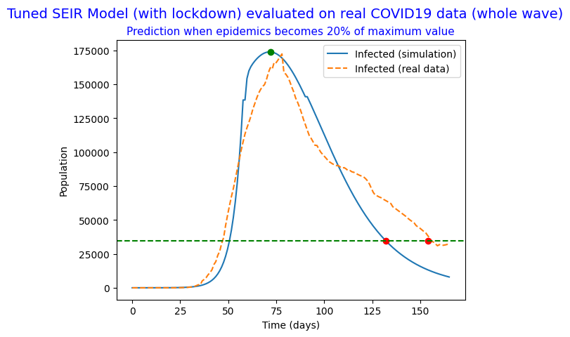
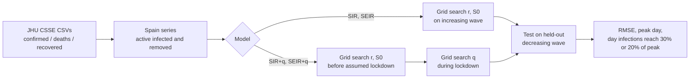
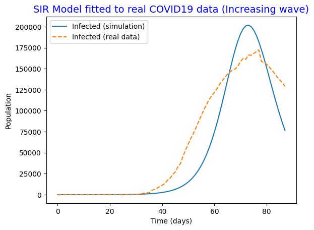
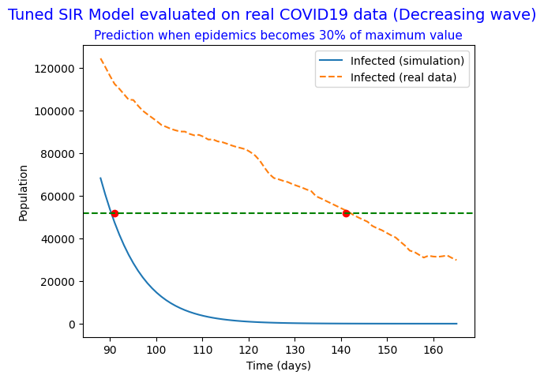
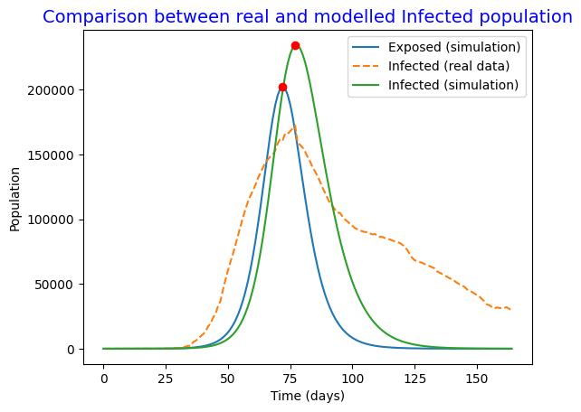
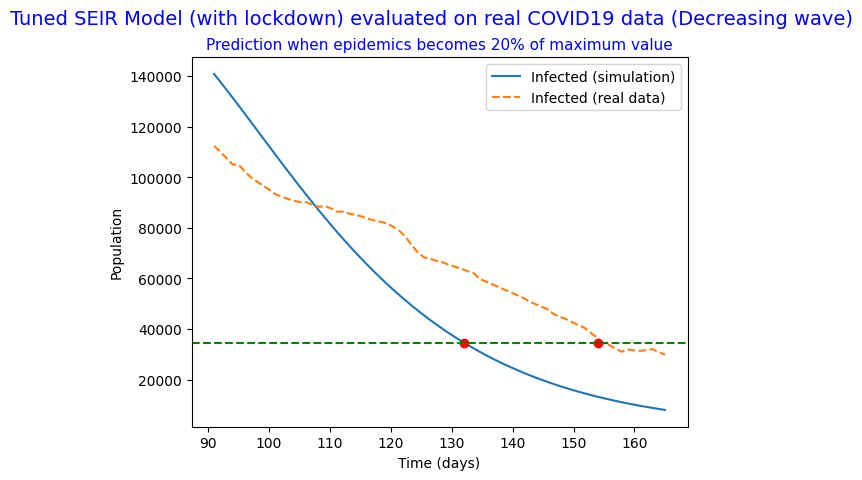

# COVID-19 SIR / SEIR Modeling: Spain, First Wave

**Four compartmental ODE models (SIR, SIR with quarantine, SEIR, SEIR with quarantine) fitted to Spain's first COVID-19 wave. Each one is calibrated by grid-search RMSE, tested on the decreasing wave it was not fitted to, and used to predict when the epidemic would decline.**

<p align="center">
  
</p>

---

## Overview

Compartmental models such as SIR and SEIR are the standard way to reason quantitatively about epidemics. They link a few interpretable parameters (infectivity, recovery rate, incubation rate, and the effect of interventions) to the shape of an outbreak curve. This project asks a practical question: **how well do these textbook models fit and predict real data, and how much does adding a latency compartment or a lockdown term help?**

We used the Johns Hopkins CSSE daily time series for **Spain** (confirmed cases, deaths and recoveries), built the active-infected and removed curves for the first wave, and then:

1. calibrated each model on part of the wave,
2. evaluated it on the rest of the wave (out-of-sample),
3. used the fitted model to predict two key dates: the epidemic peak (when $R_0$ falls below 1, or $dI/dt < 0$) and when infections drop to a fixed fraction of the peak.

This is a course project for *Modelling of Biomedical Systems* at the Universitat de Barcelona (May 2023).

## What I built

- **Data pipeline** from the raw JHU CSSE CSVs: extracts the Spain series and builds **active infected** $= \text{confirmed} - \text{deaths} - \text{recovered}$ and **removed** $= \text{deaths} + \text{recovered}$. Analysis windows are aligned with a configurable start offset and horizon (`start = 15`, `time = 180`).
- **Four ODE models** written as `scipy.integrate.odeint` right-hand sides: `SIR`, `qSIR`, `SEIR`, `qSEIR`.
- **Grid-search calibration** of the infectivity $r$ and the effective susceptible population $S_0$. Each search was coarse-to-fine over 30×30 grids of $(r, S_0)$, with RMSE against the real infected curve. For the quarantine models this was followed by a 1-D search over the quarantine rate $q$.
- **Piecewise (pre- and post-lockdown) fitting**: $r$ and $S_0$ are fitted before the assumed lockdown onset. The end state of that fit is the initial condition for fitting $q$ during lockdown, and the result is then propagated forward to test on the remaining data.
- **Out-of-sample evaluation** on the decreasing wave, which was held out from fitting. This covers test RMSE and the error in days for the predicted time at which infections fall to 30% (or 20%) of the peak.
- **Epidemic-peak analysis**: finds the day when $R_0(t) = r\,S(t)/a < 1$ and compares it with the day when $dI/dt$ (and $dE/dt$ for SEIR) becomes negative. The notebook also discusses why the SIR-based $R_0$ does not match the SEIR peaks exactly.

## Models

Notation: $S$ = susceptible, $E$ = exposed (latent), $I$ = infected, $R$ = removed (recovered + deceased).

**SIR**

$$\frac{dS}{dt} = -rSI,\qquad \frac{dI}{dt} = rSI - aI,\qquad \frac{dR}{dt} = aI$$

**SIR with quarantine.** Infected individuals are also removed at quarantine rate $q$:

$$\frac{dS}{dt} = -rSI,\qquad \frac{dI}{dt} = rSI - aI - qI,\qquad \frac{dR}{dt} = (a+q)I$$

**SEIR.** Adds a latent compartment with incubation rate $\eta$:

$$\frac{dS}{dt} = -rSI,\qquad \frac{dE}{dt} = rSI - \eta E,\qquad \frac{dI}{dt} = \eta E - aI,\qquad \frac{dR}{dt} = aI$$

**SEIR with quarantine**

$$\frac{dS}{dt} = -rSI,\qquad \frac{dE}{dt} = rSI - \eta E,\qquad \frac{dI}{dt} = \eta E - aI - qI,\qquad \frac{dR}{dt} = (a+q)I$$

**Basic reproductive ratio** (SIR form): $R_0 = r\,S/a$. The epidemic grows while $R_0 > 1$.

**Fixed parameters** (from the notebook):

| Parameter | Value |
|---|---|
| $a$ (recovery rate) for SIR | $1/2.3\ \text{days}^{-1}$ |
| $a$ (recovery rate) for SEIR | $1/7.5\ \text{days}^{-1}$ |
| $\eta$ (incubation rate) for SEIR | $1/5.2\ \text{days}^{-1}$ |

When the SEIR models are compared to data, the real "active infected" series is matched against the model's **E** compartment. The notebook explains this choice in section *SEIR model → 2. Definition of variables*.

### Fitting pipeline



Lockdown in Spain began 52 days after the first day of the dataset. Fitting with that onset gave a quarantine factor of about zero, so the onset is set to **day 72** of the raw data. The notebook justifies this delay by the incubation period and by lockdown taking time to have an effect.

## Results

All numbers below are copied from the saved notebook outputs. Days are counted from the start of the analysis window (raw data shifted by `start = 15` days).

### Fitted parameters and error

| Model | Fitted parameters | Fit RMSE (people) | Test RMSE, decreasing wave (people) |
|---|---|---|---|
| SIR | $r = 1.45\times10^{-7}$, $S_0 = 4{,}241{,}379.31$ | 26,335.09 | 64,766.26 |
| SIR + quarantine | $r = 1.1\times10^{-7}$, $S_0 = 5{,}586{,}206.9$, $q = 0.01$ | 6,716.51 (pre-lockdown) / 79,982.2 ($q$ stage) | 66,383.87 |
| SEIR | $r = 7.28\times10^{-7}$, $S_0 = 889{,}655.17$ | 28,830.35 (relative RMSE 3.24%) | 67,956.44 |
| **SEIR + quarantine** | $r = 2.6\times10^{-7}$, $S_0 = 5{,}103{,}448.28$, $q = 1.0$ | 10,000.33 (pre-lockdown) / 20,706.11 ($q$ stage) | **23,086.41** |

### Predicting the decline of the epidemic

| Model | Threshold | Model day | Real-data day | Prediction error |
|---|---|---|---|---|
| SIR | 30% of peak | 91 | 141 | 50 days |
| SIR + quarantine | 20% of peak | 93 | 154 | 61 days |
| SEIR | 30% of peak | 88 | 141 | 53 days |
| **SEIR + quarantine** | 20% of peak | 132 | 154 | **22 days** |

### Peak timing

| Model | $R_0 < 1$ | $dE/dt < 0$ | $dI/dt < 0$ |
|---|---|---|---|
| SIR | day 73 | n/a | day 73 |
| SIR + quarantine | n/a | n/a | day 69 |
| SEIR | day 75 | day 72 | day 77 |
| SEIR + quarantine | n/a | day 72 | day 58 |

### Key takeaways

- Plain **SIR and SEIR fit the rising wave reasonably well but generalize poorly**. Test RMSE is more than twice the fit RMSE, and both models predict the decline about 50 days too early. The real first wave is strongly **asymmetric**, with a slow tail, while these models produce near-symmetric curves.
- Adding quarantine to SIR **did not help**: the prediction error grew to 61 days.
- **SEIR + quarantine performed best** of the four models: test RMSE 23,086 and prediction error 22 days. The piecewise fit (before and after lockdown) lets the model follow the asymmetric curve.
- The fitted $S_0$ values (about 0.9–5.6 M) are far below Spain's population of about 47 M. The notebook reads this as the well-mixed assumption failing: an infected person is not in contact with the whole population.

<table>
<tr>
<td></td>
<td></td>
</tr>
<tr>
<td align="center"><sub>SIR fitted to the increasing wave</sub></td>
<td align="center"><sub>SIR on the held-out decreasing wave (50-day prediction error)</sub></td>
</tr>
<tr>
<td></td>
<td></td>
</tr>
<tr>
<td align="center"><sub>SEIR: E and I compartments vs real infected</sub></td>
<td align="center"><sub>SEIR + quarantine on the held-out decreasing wave (22-day error)</sub></td>
</tr>
</table>

All 18 figures from the notebook are in [`figures/`](figures/).

### Limitations (as discussed in the notebook)

- Closed, homogeneous, well-mixed population. There are no migrations, no births, no differences in severity, and no reinfection. Only one wave is modeled.
- Fitting is a manual coarse-to-fine grid search. Two fitted values lie on the edge of their search range: $q = 0.01$ for SIR + quarantine and $q = 1.0$ for SEIR + quarantine (for $q = 1.0$ the notebook says so explicitly).
- The authors note that the SEIR + quarantine calibration was chosen deliberately. Fitting $r$ and $S_0$ more tightly gave worse $q$ fits and worse predictions, so the less tight fit was kept.
- The data cover all of Spain, so separate regional outbreaks are merged into one curve.

## Tech stack

Python · NumPy · pandas · SciPy (`odeint`) · Matplotlib · Jupyter / Google Colab

## Repository structure

```
.
├── covid19_sir_seir_modeling.ipynb   # Full analysis with saved outputs (44 cells)
├── data/
│   ├── time_series_covid_19_confirmed.csv
│   ├── time_series_covid_19_deaths.csv
│   └── time_series_covid_19_recovered.csv
├── figures/                          # 18 plots extracted from the notebook outputs
├── requirements.txt
├── LICENSE
└── README.md
```

## Getting started

```bash
git clone https://github.com/sergimarsol/COVID19-SIR-SEIR-Modeling.git
cd COVID19-SIR-SEIR-Modeling
python -m venv .venv && source .venv/bin/activate
pip install -r requirements.txt
jupyter notebook covid19_sir_seir_modeling.ipynb
```

The notebook reads the CSVs from `data/` using relative paths, so run it from the repository root. It selects Spain by row index (row 235 of each CSV), so it expects the CSV files included here. Each 2-D grid search runs 900 ODE solves, and the full notebook takes about 30 s to run on a laptop.

> **Note:** keep `numpy<1.24` as pinned in `requirements.txt`. Newer NumPy versions raise a `ValueError` in the evaluation cells, because the initial-condition tuples mix length-1 arrays and scalars. With the pinned versions, the notebook re-executes and reproduces all saved outputs exactly.

To re-execute headlessly:

```bash
jupyter nbconvert --to notebook --execute covid19_sir_seir_modeling.ipynb --output executed.ipynb
```

## Team and acknowledgements

- **Sergi Marsol**
- **Ariadna Mon**

Course project for *Modelling of Biomedical Systems* (Modelització de Sistemes Biomèdics), Biomedical Engineering, Universitat de Barcelona, May 2023.

### Data attribution

COVID-19 time series from the **COVID-19 Data Repository by the Center for Systems Science and Engineering (CSSE) at Johns Hopkins University**, <https://github.com/CSSEGISandData/COVID-19>, licensed under [CC BY 4.0](https://creativecommons.org/licenses/by/4.0/). The files in `data/` are kept unmodified (daily series from 22 Jan 2020 to 29 May 2021).

> Dong E, Du H, Gardner L. *An interactive web-based dashboard to track COVID-19 in real time.* Lancet Infect Dis. 2020;20(5):533–534. doi:10.1016/S1473-3099(20)30120-1

## License

The code is released under the [MIT License](LICENSE). The data in `data/` remain under CC BY 4.0 (JHU CSSE).
